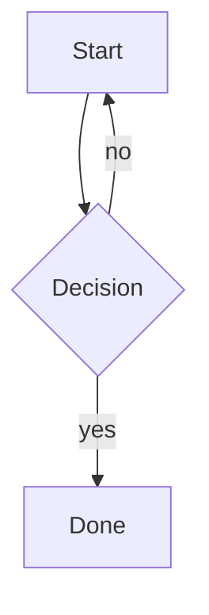

# Diagram and chart fences


```mermaid
graph TD
  A[Start] --> B{Decision}
  B -->|yes| C[Done]
  B -->|no| A
```

```chart
{
  "kind": "bar",
  "data": [
    {
      "label": "Run 1",
      "value": 4.6
    },
    {
      "label": "Run 2",
      "value": 4.2
    }
  ]
}
```